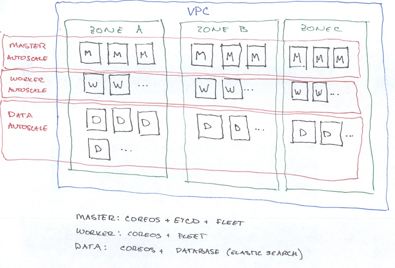
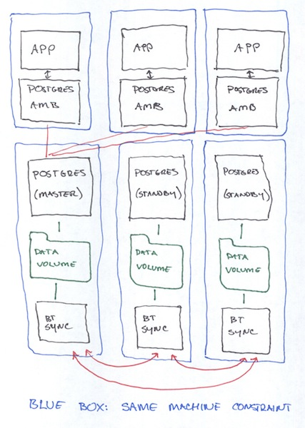

dev
===

Infrastructure for building a development and collaboration environment with
CoreOS and Docker. 

We wanted to understand what was involved in using CoreOS and Docker to provide
highly available services with AWS. While there are lots of toy examples out
there, providing real services illuminates a whole range of management and 
organization issues.

This cluster must provide a variety of services for our team:

 - Gerrit for code reviews (state is in the file system and a postgres database)
 - Buildbot for build automation (requires connection to a fleet of Windows VMs 
   hosted elsewhere, state is in the file system plus a postgres database)
 - A mediawiki instance (state is on the file system and in a ~mysql~ postgres 
   database. Sensing a pattern yet?)
 - An internal application that uses PHP (ugh) and a local database (mysql?)
 - Strong user account management, authorization and authentication. 
 - A simple internal service to upload files and email a link to the file.
 - An internal service that uses SFTP and keeps state on the local file system.
 - A number of restful services that proxy API access to other REST services.
   We cache some results from theses services with Redis. (We purchase access to
   these services but do not want to widely share the authorization keys)
 - An application that lets users self-manage SSH keys for other systems and 
   allows those systems to manage user accounts.
 - We have a dynamic team that produces ad-hoc applications from time to time. 
 
Although not critical to the program, we have production systems that use 
Elasticsearch, Cassandra and Mongodb and we want to understand how those systems 
might work in this landscape.

Here is what the architecture looks like:

  

**main** nodes (I accidentally wrote "master" on the drawing -- TODO fix it) run 
CoreOS and etcd and docker containers as coordinated by fleet. 
**worker** nodes are just like main nodes except they do not run etcd (they run
etcd-amb instead). **data** nodes run CoreOS but they run a dedicated task (i.e.
being an elasticsearch data node) via docker launched by systemd.

In this configuration the main nodes are in a fixed-size autoscaling group 
(CoreOS recommend at least three but not more than 9 machines). The worker nodes
are in an autoscaling group that can grow
and shrink as needed, possibly with automation. The data nodes are in an 
autoscaling group whose size changes manually. 

The entire configuration is described by a cloudformation document that we 
generate programmatically. 

Shared Filesystem
-----------------

Many of our applications require shared state. We considered using a distributed
file system like GlusterFS or Ceph. (TODO why didn't we use those)

Instead we chose a decentralized approach using btsync. btsync uses bittorrent
to synchronize files across volumes which share the same secret key. In this
model the application writes to the local disk but the data are available across
all zones. Experimentally the latency between btsync replicated volumes across
zones is just a couple of seconds.

**Why not use EBS?**

EBS volumes are constrained to a single availability zone. Although you can copy
snapshots across zones, this would create a high latency in the event of losing
an entire availability zone.

Database Architecture
---------------------

* Three postgres database containers on three different machines hold an 
  election to determine which should be the master. The winner runs postgres 
  while the losers block until the master dies when they can re-run the 
  leader election.

* A btsync container keeps the postgres data volume in sync across the master
  and all the slaves.

* An ambassador tracks which instance is the master and proxies for the 
  application so that the application doesn't have to care when the master 
  changes.

  

**Why not use postgres high availability?**

Two reasons. First, it seemed hard. There are a bunch of manual steps
needed to perform initial setup and manual steps after each master transition
and getting all that set up seemed pretty tricky. Second, we wanted a more 
general approach that would work with other databases (like Redis).
(ref: http://www.postgresql.org/docs/9.3/static/warm-standby.html)

Logistics
---------

### 0. Building Containers ###

Each container has a build.sh script that can be used to build, tag and push
the container to the docker registry. All the real work of the cluster is done
is containers. 

    ./build-containers.sh

### 1. Cloud Formation ###

Cloud Formation is mechanism and format for declaring AWS resources. Rather than
hand produce a repetitive document, we have code that produces a cloudformation
document you can use to create a cluster in AWS. For convenience you can also 
build and update clusters with the tool as well. 

    URL=$(curl https://discovery.etcd.io/new)
    python src/dev/cloudformation/build.py --dns-name dev.example.com \
      --key=alice@example.com \
      --discovery-url=$URL \
      create

Updating a cluster:

    python src/dev/cloudformation/build.py --dns-name dev.example.com \
      --key=alice@example.com \
      --discovery-url=$URL \
      update

Our cloud formation document launches instances in a VPC split into three 
subnets, one for each of three availability zones. All the machines are launched
in autoscaling groups which makes it so that if we (or AWS) terminate a machine,
it is automatically recreated.

**Why write code to generate cloudformation?**

  The JSON got long and repetitive. We wanted to avoid repeating ourselves, 
  break the parts up into reusable compontents and wanted to add comments and 
  stuff.

### 2. Start Units ###

The unit files are generated by a python program. Specify a directory where 
you'd like your unit files to go:

    python src/dev/units/build.py --output=units
    
You'll need to edit your secrets::

    cp secrets.sh.example secrets.sh
    vi secrets.sh
    
Copy your unit files, secrets.sh and ``start-units.sh`` to a node in your 
cluster:

    scp -r units secrets.sh start-units.sh core@ec2-XX-XX-XX-XX.us-west-2.compute.amazonaws.com:

Start the units:

    ./start-units.sh

Open Issues
-----------

- A couple of times during this process, I've encountered a case where all
  etcd nodes are down and I can't figure out how to recover from this. While
  restarting the etcds they seem not to think they are really the master.

- Exactly how to get all the fleet units configured when launching a cluster or
  adding a service is still rather an open question. I'd like to figure out.
  The mechanism described here is janky.

